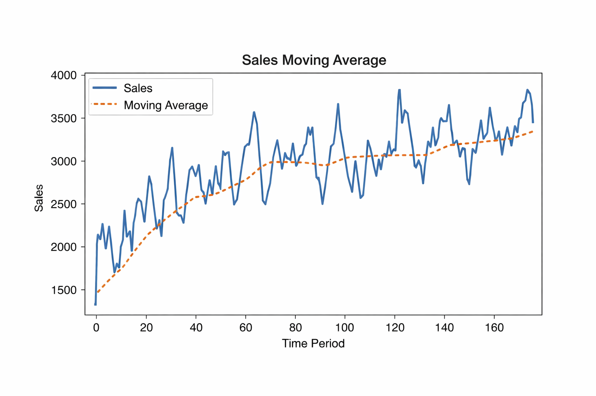
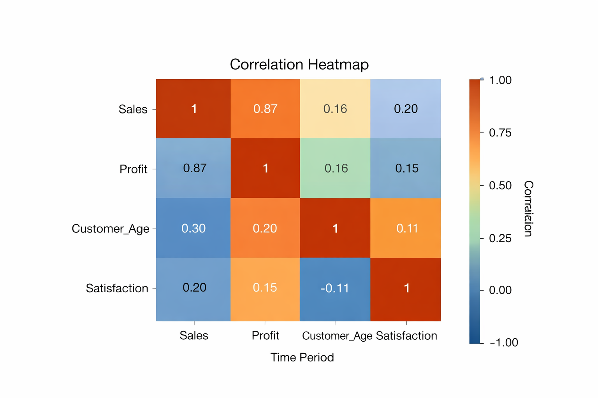

# Automated-Data-Analysis-Report-Generator
Automated Data Analysis Report Generator using Python, Pandas, and ML


---

## 📌 Overview

The **Automated Data Analysis Report Generator** is a Python-based project that converts raw data into meaningful insights and structured reports automatically.

It performs data cleaning, analysis, visualization, and generates reports with minimal human effort.

---

## 🚀 Features

* 📥 Data loading from CSV files
* 🧹 Data cleaning (missing values, duplicates)
* 📊 Statistical analysis
* 🔥 Correlation heatmap
* 📈 Graphs and trends (Sales analysis)
* 📉 Moving average visualization
* 📄 Automated report generation

---

## 🛠️ Technologies Used

* Python
* Pandas
* NumPy
* Matplotlib
* Seaborn
* Scikit-learn

---

## 📂 Project Structure

```
project-folder/
│
├── main.py
├── data.csv
├── report.pdf
├── requirements.txt
├── README.md
└── images/
    ├── output1.png
    ├── graph.png
    ├── heatmap.png
```

---

## 📊 Output Screenshots

### 📌 Dataset Preview


### 📈 Sales Graph



### 🔥 Correlation Heatmap



---

## 📄 Project Report

👉 [Click Here to View Report](report.pdf)

---

## ▶️ How to Run the Project

### 1️⃣ Clone the repository

```
git clone https://github.com/your-username/automated-data-analysis-report-generator.git
cd automated-data-analysis-report-generator
```

### 2️⃣ Install dependencies

```
pip install -r requirements.txt
```

### 3️⃣ Run the program

```
python main.py
```

---

## 📊 Sample Dataset

The project uses a CSV dataset with columns:

* Date
* Sales
* Profit
* Customer Age
* Satisfaction

---

## 📈 Results

* Generates statistical summaries
* Identifies patterns and trends
* Creates visualizations (graphs, heatmaps)
* Produces a report file automatically

---

## 🎯 Objectives

* Automate data analysis process
* Reduce manual effort
* Improve accuracy and efficiency
* Generate clear and structured reports

---

## 🔮 Future Enhancements

* 🌐 Web-based dashboard (Streamlit)
* 🤖 Machine Learning predictions
* ☁️ Cloud integration
* 📊 Interactive visualizations

---

## 👨‍💻 Author

**Margam Rohan**
B.Tech CSE
Vardhaman College of Engineering

---

## ⭐ Support

If you like this project:

* ⭐ Star the repository
* 🍴 Fork it
* 📢 Share with others

---
